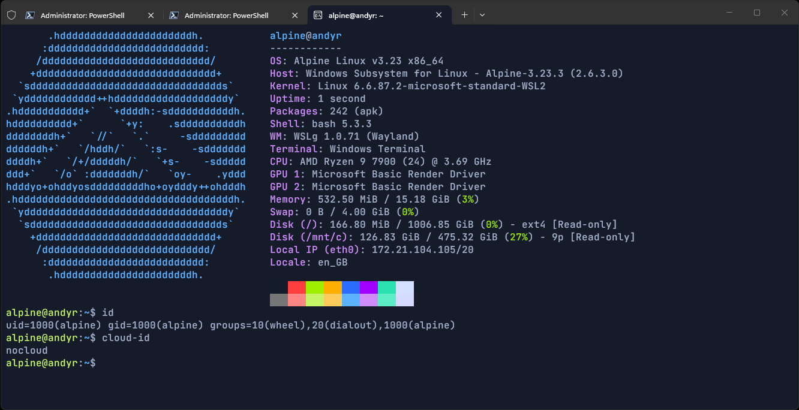

# `WSL` Datasource

The `alpine-all.user-data` file is a direct copy of the `.config\var\lib\cloud\seed\nocloud\user-data` config provided for the `NoCloud` datasource. It has been provided as an example of where the file should be stored in Windows for `cloud-init` to discover it, when using the WSL datasource.

Documentation:

- `cloud-init` [WSL guidance](https://cloudinit.readthedocs.io/en/latest/reference/datasources/wsl.html)
- `cloud-init` [module reference](https://cloudinit.readthedocs.io/en/latest/reference/modules.html)
- `cloud-init` [config examples](https://cloudinit.readthedocs.io/en/latest/reference/examples.html)

## Validating User-Data

After running the `Install-AlpineLinux.ps1` script without user-data in `%USERPROFILE%\.cloud-init`, you will have an Alpine WSL distro, which has been configured with the `NoCloud` datasource. You can use that Alpine distro to validate any `cloud-init` user-data you want to use for your setup, which will become a `WSL` datasource configuration. Below we will use an admin Powershell terminal to run WSL commands on the installed Alpine distro and pipe them back to our terminal.

This first command will identify the Windows PATH for your WSL datasource user-data config that you must create:

```ps1
Join-Path $env:USERPROFILE ".cloud-init\alpine-all.user-data"
```

Example output - `C:\Users\Ridya\.cloud-init\alpine-all.user-data`

> [!NOTE]
> The name of the user-data file indicates the distro and version `cloud-init` should apply the config to (see WSL guidance).

Next, we will use the WSL interop tool `wslpath` to translate this Windows PATH to a Linux PATH:

> [!CAUTION]
> Wrap the PATH in single quotes and double quotes to mitigate any issues with escape characters in Linux.

```ps1
wsl -d Alpine-3.23.3 wslpath "'C:\Users\Ridya\.cloud-init\alpine-all.user-data'"
```

Example output - `/mnt/c/Users/Ridya/.cloud-init/alpine-all.user-data`

We can now use `cloud-init schema` to validate the user-data from Alpine:

```ps1
wsl -d Alpine-3.23.3 doas cloud-init schema --config-file "/mnt/c/Users/Ridya/.cloud-init/alpine-all.user-data" --annotate
```

```ps1
Valid schema /mnt/c/Users/Ridya/.cloud-init/alpine-all.user-data
```

```ps1
2026-02-16 16:12:00,624 - jinja_template.py[WARNING]: Could not render jinja template variables in file '/mnt/c/Users/Ridya/.cloud-init/alpine-all.user-data': 'distros', 'distros', 'distros'
Valid schema /mnt/c/Users/Ridya/.cloud-init/alpine-all.user-data
```

## WSL Unregister & Reinstall Vs. Cloud-init Clean Reboot

`Cloud-init` identifies a suitable datasource and user-data config during initial boot. Once the script has run, this process has completed, but it can be restarted.

By running the command `doas cloud-init clean --logs --reboot` within  Alpine, followed by termination and reboot - `cloud-init` will now restart its initial boot process and identify any relevant user-data files you have placed in `%USERPROFILE%\.cloud-init\`.

You can also run `wsl --unregister Alpine-3.23.3` and then run the installation script once again, after placing user-data in `%USERPROFILE%\.cloud-init\`. Check the distro name installed by the script, which is 'Alpine-[version]' (`wsl --list`).

> [!CAUTION]
> Making `cloud-init` run again may be destructive and must never be done on a production system. Artefacts such as ssh keys or passwords may be overwritten.

If you ran the installation script without any suitable user-data in `%USERPROFILE%\.cloud-init`, then you will have a ready-to-use Alpine distro, with a default user named 'alpine', which `cloud-init` configured using the provided `NoCloud` datasource user-data.



The bootstrap `/etc/wsl.conf` file has been appended to by `cloud-init`, using the `write_files` module within the user-data file. This module is used to set the default user as 'alpine', which is set in the `Jinja2` template, with a `cloud-init` variable - ``:

```yaml
write_files:
  # ----------------------------------------------
  # Set generated `username` as WSL default user
  # ----------------------------------------------
  - path: /etc/wsl.conf
    content: |
      [user]
      # user created by `cloud-init`
      default = {{ username }}
    append: true
```

If you were to run the command `doas cloud-init clean --logs --reboot` followed by termination and reboot, then `cloud-init` would create any ***NEW*** users within your user-data config inside `%USERPROFILE%\.cloud-init\`. If you kept same username ('alpine'), the only changes which are applied by `cloud-init` would be 'plain_text_passwd', 'hashed_passwd', 'lock_passwd', 'sudo', 'ssh_authorized_keys' and 'ssh_redirect_user'.

### Suggestion

The easiest option, is to unregister and reinstall - if you needed to debug/validate your own WSL user-data config or to simply place your user-data in `%USERPROFILE%\.cloud-init\` before running the `Install-AlpineLinux.ps1` script.

This avoids you having to modify the `/etc/wsl.conf` manually to update the default user setting for example.
